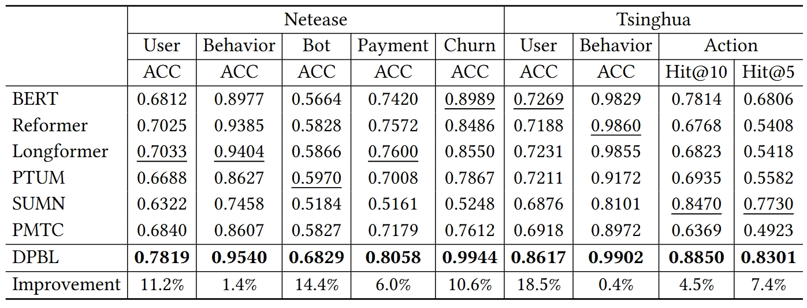

# DPBL: Denoised Player Behavior Representation Learning

*Our Python version is 3.5.2 and the torch version is 1.2.0.*

## Introduction
This repository is the repository of **DPBL: Denoised Player Behavior Representation Learning** (currently under submission). DPBL is an unsupervised representation learning model for learning informative and high-quality representations for player behavior sequences with low signal-to-noise ratio.

## Datasets
+ By default, our dataloader will load the data from CSV files as the training dataset or test dataset, and the format of each line in these files is as follows:

  ~~~
  user_id, date, timestamp1, action1, timestamp2, action2, timestamp3, action3, ...
  ~~~
  where each action is represented as an integer.

+ If you want to load your data in other formats, you need to preprocess the data into the format we specify or implement your own dataloader by editing `./dpbl/dataset/dataset_test.py` and `./dpbl/dataset/dataset_train.py`.

## Quick Demos
1. Put your dataset under `./data`
2. We provide the following script to train the model:
    ```bash
    bash ./scripts/train.sh
    ``` 
3. For inference, we provide the following script to generate representations:
    ```bash
    bash ./scripts/inference.sh
    ```
4. After pre-training, you can generate representations for the datasets of downstream tasks. Put the representations and the corresponding labels under `./data` and run the following script to train a classifier for downstream tasks:
   ```bash
   bash ./scripts/downstream_tasks.sh
   ```

## Detailed Usage
The directory of this repository is organized as follows:
```
Project
  |—— config.json
  |—— main.py
  |—— data
  |—— save
  |—— logs
  |—— dpbl
      |—— dataset
      |—— model
      |—— trainer
  |—— classifier
      |—— model
      |—— classifier.py
  |—— scripts
```
Specifically, the details of each sub-directory or file are as follows:
+ `./config.json` defines the hyperparameters about the number of embedding table entries, the minimum length and the maximum length of user behavior sequences
+ `./main.py`: the main function to pre-train DPBL and to infer on test datasets
+ `./data` is the directory to put datasets
+ `./save` is the directory to save model parameters
+ `./logs` is the directory for log files
+ `./dpbl` is the implementation of the proposed DPBL
  + `./dataset` contains our dataloaders
  + `./model` implements the two-stage attention-based architecture of DPBL
  + `./trainer`: how we optimize DPBL with two contrastive learning strategies  
+ `./classifier` is the classifier for downstream tasks
  + `./model` implements a simple classifier, the corresponding dataloader and optimizer
  + `./classifier.py` is the main function to train the classifier and to infer on test datasets
+ `./scripts` contains our scripts for pre-training, inference and training on downstream tasks

## Main results
The main results on NetEase dataset and Tsinghua dataset are as follows:


